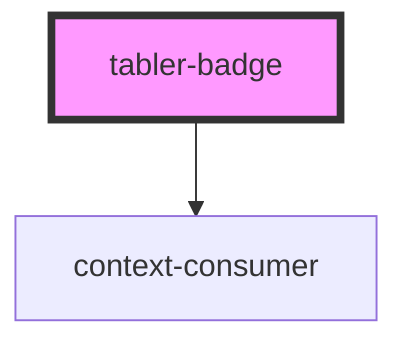

# tabler-badget

<!-- Auto Generated Below -->

## Properties

| Property    | Attribute    | Description                                       | Type                                                                                                                            | Default     |
| ----------- | ------------ | ------------------------------------------------- | ------------------------------------------------------------------------------------------------------------------------------- | ----------- |
| `color`     | `color`      | 标签颜色                                          | `"azure" \| "blue" \| "cyan" \| "green" \| "indigo" \| "lime" \| "orange" \| "pink" \| "purple" \| "red" \| "teal" \| "yellow"` | `undefined` |
| `href`      | `href`       | 点击跳转的地址，指定此属性按钮的行为和 a 链接一致 | `string`                                                                                                                        | `undefined` |
| `light`     | `light`      |                                                   | `boolean`                                                                                                                       | `false`     |
| `outline`   | `outline`    |                                                   | `boolean`                                                                                                                       | `false`     |
| `pill`      | `pill`       |                                                   | `boolean`                                                                                                                       | `false`     |
| `prefixCls` | `prefix-cls` |                                                   | `string`                                                                                                                        | `undefined` |
| `target`    | `target`     | 相当于 a 链接的 `target` 属性，`href` 存在时生效  | `string`                                                                                                                        | `undefined` |

## Dependencies

### Depends on

- context-consumer

### Graph

---

_Built with [StencilJS](https://stenciljs.com/)_
