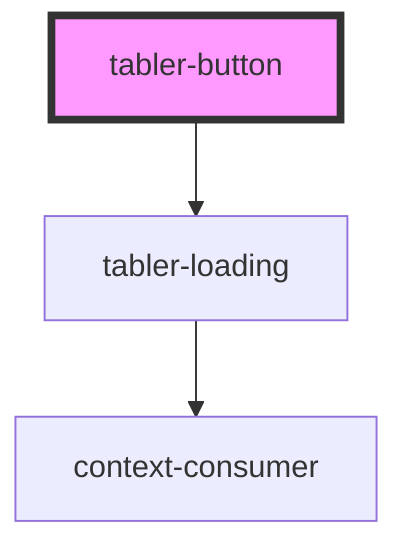

# tabler-button

<!-- Auto Generated Below -->

## Properties

| Property   | Attribute  | Description  | Type      | Default     |
| ---------- | ---------- | ------------ | --------- | ----------- |
| `block`    | `block`    | 是否独占一行 | `boolean` | `false`     |
| `circle`   | `circle`   | 是否圆形按钮 | `boolean` | `false`     |
| `disabled` | `disabled` | 是否禁用状态 | `boolean` | `false`     |
| `icon`     | `icon`     | 图标类名     | `string`  | `undefined` |
| `loading`  | `loading`  | loading      | `boolean` | `false`     |
| `plain`    | `plain`    | 是否朴素按钮 | `boolean` | `false`     |
| `round`    | `round`    | 是否圆角按钮 | `boolean` | `false`     |
| `size`     | `size`     |              | `string`  | `'default'` |
| `type`     | `type`     | 类型         | `string`  | `'primary'` |

## Dependencies

### Depends on

- [tabler-loading](../loading)

### Graph

---

_Built with [StencilJS](https://stenciljs.com/)_
