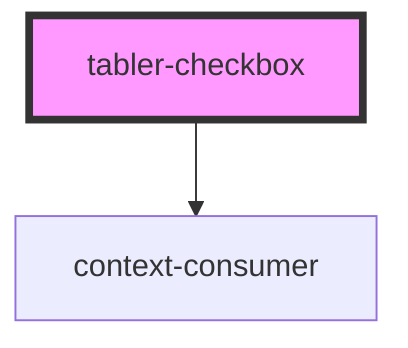

# tabler-checkbox

<!-- Auto Generated Below -->

## Properties

| Property    | Attribute    | Description | Type      | Default     |
| ----------- | ------------ | ----------- | --------- | ----------- |
| `checked`   | `checked`    |             | `boolean` | `false`     |
| `disabled`  | `disabled`   |             | `boolean` | `false`     |
| `label`     | `label`      |             | `string`  | `undefined` |
| `prefixCls` | `prefix-cls` |             | `string`  | `undefined` |

## Dependencies

### Depends on

- context-consumer

### Graph

---

_Built with [StencilJS](https://stenciljs.com/)_
