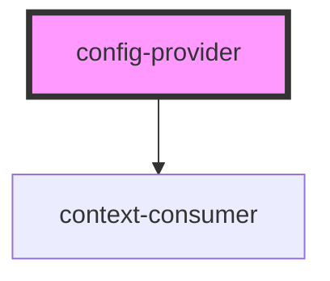

# config-provider

<!-- Auto Generated Below -->

## Properties

| Property    | Attribute    | Description | Type     | Default  |
| ----------- | ------------ | ----------- | -------- | -------- |
| `prefixCls` | `prefix-cls` |             | `string` | `'tblr'` |

## Dependencies

### Depends on

- context-consumer

### Graph

---

_Built with [StencilJS](https://stenciljs.com/)_
