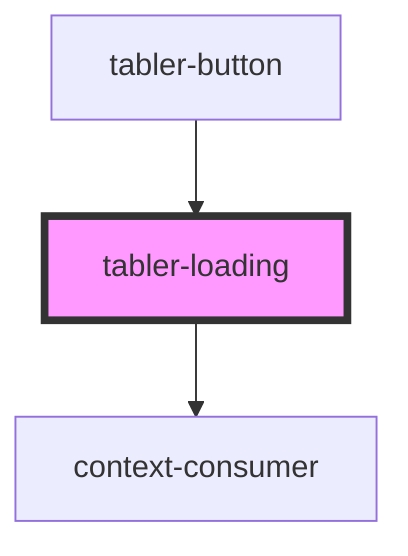

# tabler-loading

<!-- Auto Generated Below -->

## Properties

| Property    | Attribute    | Description | Type                                                                                                                            | Default     |
| ----------- | ------------ | ----------- | ------------------------------------------------------------------------------------------------------------------------------- | ----------- |
| `color`     | `color`      | 颜色        | `"azure" \| "blue" \| "cyan" \| "green" \| "indigo" \| "lime" \| "orange" \| "pink" \| "purple" \| "red" \| "teal" \| "yellow"` | `'blue'`    |
| `prefixCls` | `prefix-cls` |             | `string`                                                                                                                        | `undefined` |
| `size`      | `size`       | 大小        | `"default" \| "small"`                                                                                                          | `'default'` |
| `type`      | `type`       | 样式        | `"grow" \| "spinner"`                                                                                                           | `'spinner'` |

## Dependencies

### Used by

- [tabler-button](../button)

### Depends on

- context-consumer

### Graph

---

_Built with [StencilJS](https://stenciljs.com/)_
