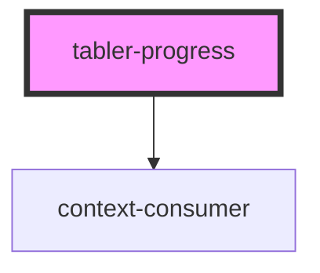

# tabler-progress

<!-- Auto Generated Below -->

## Properties

| Property    | Attribute    | Description | Type     | Default     |
| ----------- | ------------ | ----------- | -------- | ----------- |
| `percent`   | `percent`    | 百分比      | `number` | `undefined` |
| `prefixCls` | `prefix-cls` |             | `string` | `undefined` |

## Dependencies

### Depends on

- context-consumer

### Graph

---

_Built with [StencilJS](https://stenciljs.com/)_
