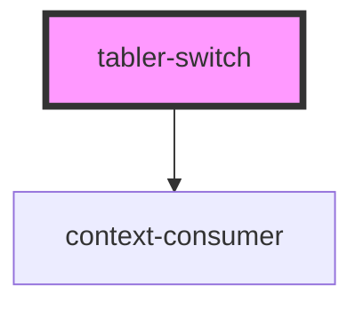

# tabler-switch

<!-- Auto Generated Below -->

## Properties

| Property    | Attribute    | Description      | Type                 | Default     |
| ----------- | ------------ | ---------------- | -------------------- | ----------- |
| `checked`   | `checked`    | 打开状态的受控值 | `boolean`            | `false`     |
| `disabled`  | `disabled`   | 不可用状态       | `boolean`            | `false`     |
| `prefixCls` | `prefix-cls` |                  | `string`             | `undefined` |
| `size`      | `size`       | 开关尺寸         | `"large" \| "small"` | `'small'`   |

## Dependencies

### Depends on

- context-consumer

### Graph

---

_Built with [StencilJS](https://stenciljs.com/)_
